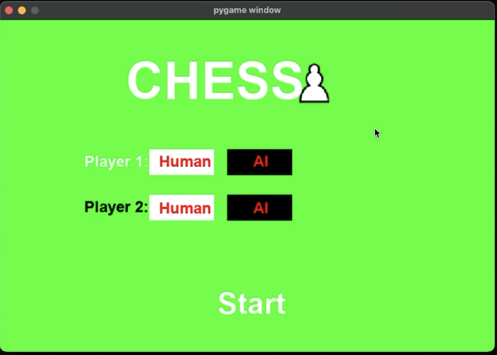
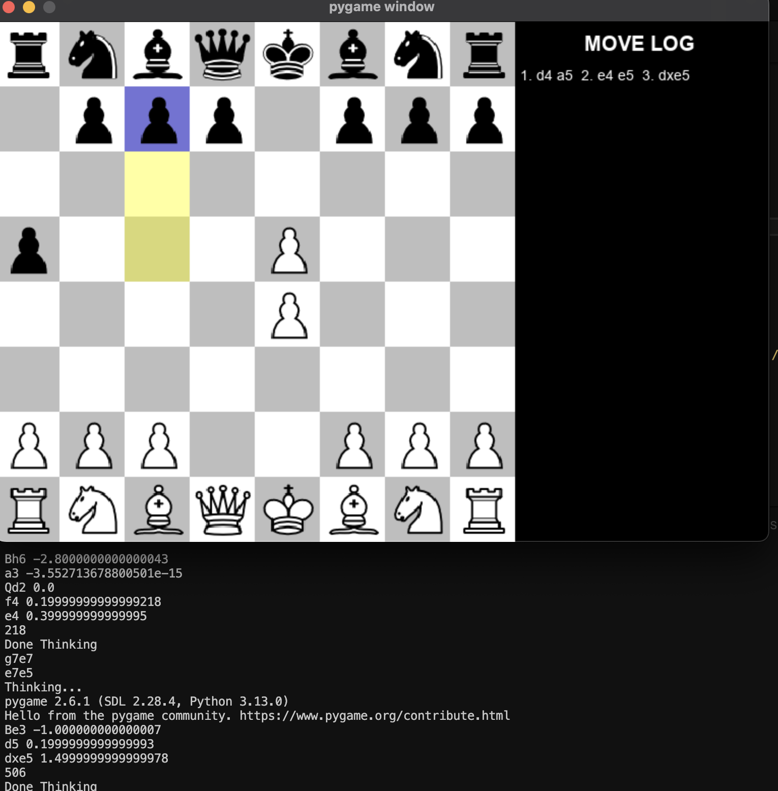
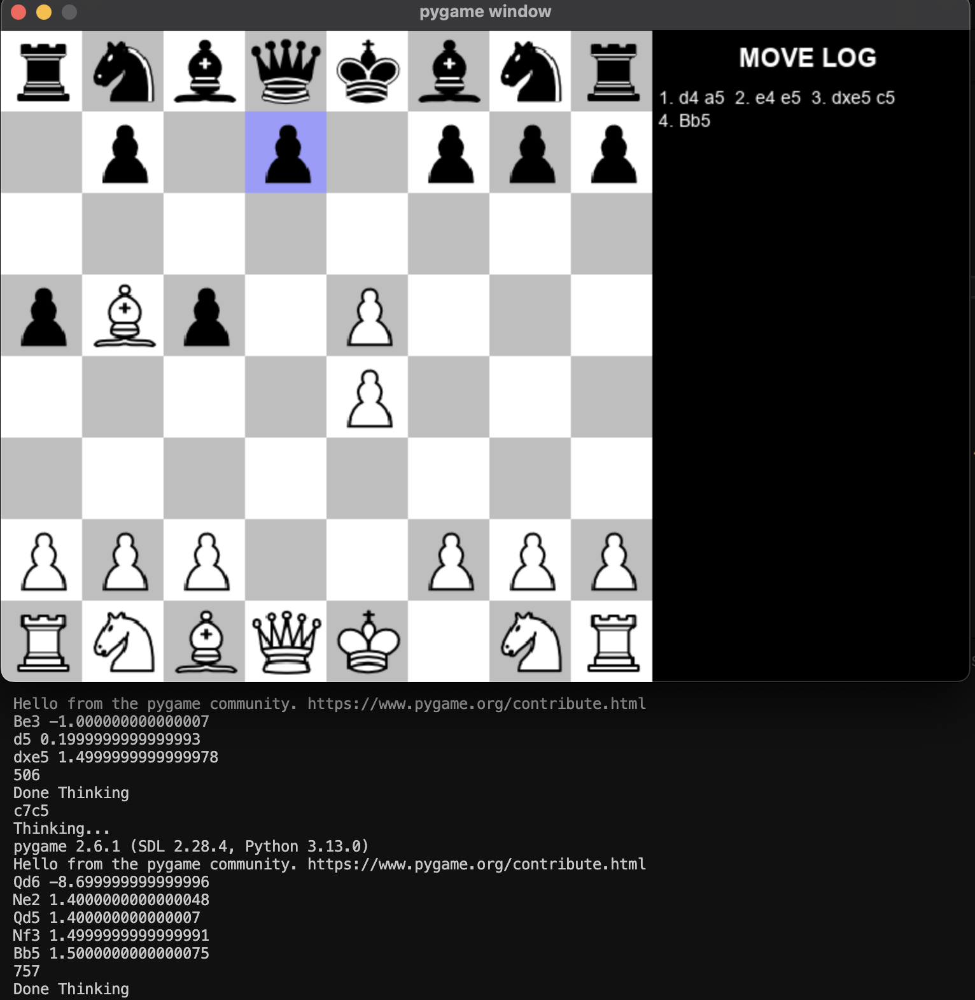
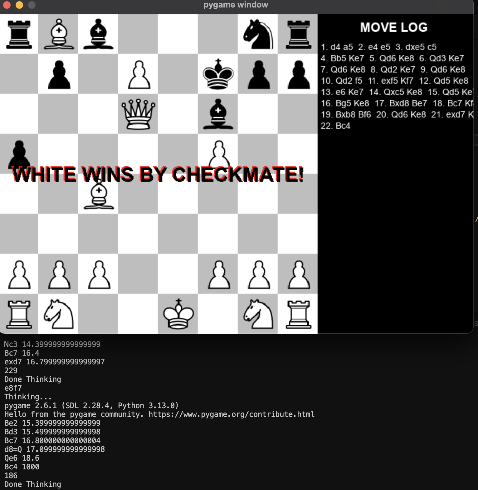

- Chess Engine + Bot + GUI

My Chess Game. Made with Pygame, it can be played with another person or a Chess bot, powered by powerful algorithms and data structures to make it a challenging opponent.

About: This chess game has 3 files:

- Engine: The engine includes the board, rules, and moves a player can make, including the bot.
- SmartMoveFinder: This is the AI bot that determines the best moves based on board position, piece value, and the current game state.
- Main: This runs the code, checks for input, and handles all the UI.

About Chess Bot: This bot is smart! I have mapped each spot on the board and assigned it a value based on how good I think it is inside the chess engine. Each piece is given a value based on its importance. The game state informs the bot of the board layout, its moves, and pieces under attack, giving it all the knowledge it needs to make a move.

This bot uses algorithms like MinMax recursion, NegaMax, Alpha-Beta Pruning, and greedy algorithms to effectively pick a move. It scans the board, evaluates every move, considers every possible state the board can be in, and assesses all opponent moves. During each recursion, it uses its knowledge of the board and pieces to choose the highest-value move.

One thing that makes this bot fast and efficient is Alpha-Beta Pruning. Earlier, I mentioned that the bot looks at every move and game state. But what if there's a move or game state that has the highest value? For example, if one move allows the bot to capture a queen with a pawn or capture a pawn with a pawn, the bot knows from piece values that capturing the queen is the best move. It stops searching for more moves and game states and takes that move immediately.

If you want to play, download the folder and run the main file. NOTE: You must change the image file path if you're on Windows, and you need Pygame installed in your Python workspace. OK, BYEE!

- Here are some pics of the game PLZ NOTE: all the effort was for the back end!
- Here is the link to the live demo: https://www.youtube.com/watch?v=lJkVwCNmqOE

   